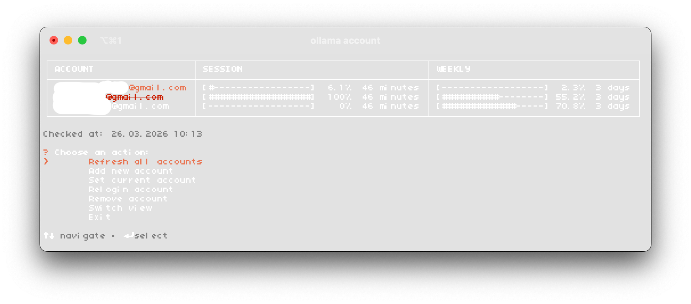

# Ollama Usage Tracker

Терминальное приложение для отслеживания `Cloud Usage` сразу по нескольким аккаунтам Ollama

Приложение использует Playwright и отдельный профиль Chrome для каждой почты.



## Требования

- macOS
- `zsh`
- Node.js 18+
- установленный Google Chrome в `/Applications/Google Chrome.app`

## Установка

```bash
git clone https://github.com/rustam-mkn/Ollama-usage-tracker.git
cd Ollama-usage-tracker
npm install
npm run install:zsh
source ~/.zshrc
```

## Запуск

Основной запуск:

```bash
ollama account
```
реальный `ollama` не подменяется и не ломается.

Если нужно запустить напрямую без shell-интеграции:

```bash
node ./src/cli.js
```


## Структура проекта

```text
config/accounts.json        список отслеживаемых аккаунтов и настройки интерфейса
data/current-account.txt    текущий подсвеченный аккаунт
data/usage-snapshot.json    последний сохраненный usage snapshot
profiles/                   постоянные Chrome-профили, по одному на аккаунт
src/cli.js                  точка входа
src/services/menu.js        интерактивное меню
src/services/usage-collector.js
                            сбор usage через Playwright
src/storage/store.js        работа с конфигом и snapshot
src/render.js               терминальный рендер интерфейса
```
